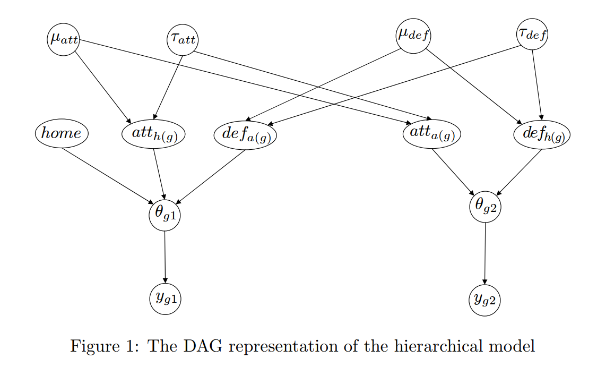

# Bayesian Soccer Predictor Model

## Leagues included

- Bundesliga
- La Liga
- Premier League
- Serie A
- Ligue 1

## Model

- Press [here](https://docs.pymc.io/notebooks/rugby_analytics.html) to see original PyMC3 implementation of the model.

- Press [here](http://discovery.ucl.ac.uk/16040/1/16040.pdf) to see the original paper.

## Data

- Press [here](https://datahub.io/collections/football#football-datasets-on-datahub) to access the dataset. 

Link: https://datahub.io/collections/football#football-datasets-on-datahub